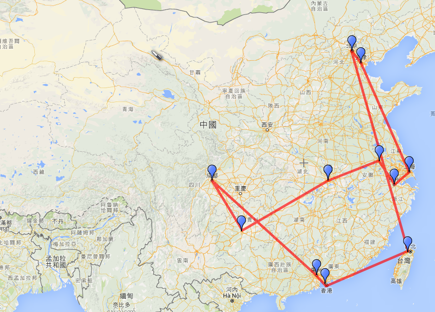

## 零售業 IT 的中國冒險記

[TOC]

### 前言

我目前在一間版圖跨越台灣、日本、香港、中國的零售業公司內擔任 IT。在這之前曾經在已經上軌道的知名網路服務公司、一間跨國大型企業內，以及其他~~奇奇怪怪~~的地方工作。

敝社在中國大約有 10 幾個點，散佈在各省份。這篇要講的就是一口氣把這些點踩完的過程和心得。

### 緣起

因為老闆說：你們去繞一圈看看有什麼問題，順便幫他們處理一下。

於是**行動代號：八千里路雲和月**就啟動了

### 行程規劃

因為我們對中國的交通實在是沒什麼概念，所以麻煩上海的同事，考慮各個點之間最方便的交通方式以及時間之後，幫我們排了以下的行程：

| 日數   | 交通               | 行程       |
| ---- | ---------------- | -------- |
| 1    | 飛機：台北→北京         | 北京 2 間門市 |
| 2    | 高鐵：北京→天津         | 天津 1 間門市 |
| 3    | 飛機：天津濱海機場→上海虹橋機場 | 上海 3 間門市 |
| 4    | （停留上海）           |          |
| 5    | 高鐵：上海→杭州         | 杭州 1 間門市 |
|      | 高鐵：杭州→南京         | 南京 1 間門市 |
| 6    | 高鐵：南京→武漢         | 武漢 1 間門市 |
| 7    | 飛機：武漢→貴陽         | 貴陽 1 間門市 |
| 8    | （停留貴陽）           |          |
| 9    | 飛機：貴陽→成都         | 成都 1 間門市 |
|      | 飛機：成都→廣州         | 廣州 1 間門市 |
| 10   | 火車：廣州→香港         | 香港 3 間門市 |
| 11   | 飛機：香港→台北         |          |

畫在地圖上大概會是這樣的感覺

以上在十一天內搞定（暈

### 行前準備

#### 行李

* 登山背包、背包防水罩、行李束帶
* 護照、台胞證
* RFID 防盜證件套（因為我是卡式台胞證）
* 人民幣，少部分用夾鍊袋隨身攜帶。多的分散放在包包各處。
* iPad mini、手機、充電線、充電器
* 筆記型電腦
* 行動電源
* 旅行用多國插座
* 十一天份的
  * 內褲
  * T-Shirt
  * 襪子

* 個人盥洗用具
  * 洗澡肥皂
  * 洗面乳
  * 洗髮精
  * 刮鬍刀
  * 牙刷
  * 牙膏

* 垃圾袋數個（裝髒衣服、包筆電防水、包盥洗用具以免爆開）
* 折疊傘
* 頸枕
* 3M 耳塞

因為這樣的行程看起來有一大部分的時間都會花在趕車趕飛機上面，總共十一天的行程如果拉行李箱東奔西跑應該會很痛苦。所以我決定用一個大型登山背包把十一天的換洗衣服、盥洗用具全部塞進去。坐飛機需要托運時用另外買的背包防水罩整個罩起來以後，再用行李束帶整個捆起來一整包就托運了。內容物有十一天份的內褲、襪子、T-Shirt 等等。筆電跳過托運另外手提上飛機。

我另外還有一個隨身的小包包，放錢包、手機、iPad、行動電源等等哩哩摳摳的東西，這也一起背上飛機。

事後證明（我個人認為）用登山背包的行動力的確可以比拖行李箱高很多。尤其是在人行道的妥善率以及無障礙設施明顯不足的中國二線城市，行李箱光上上下下人行道就已經想要翻臉，如果再加上下雨就更是處境惡劣了。而且中國每個地鐵站在進站的時候都需要安檢，必須要把行李箱扛進 X 光機，多來幾次真的是滿苦的。

背包大概下圖是這種感覺，防水罩正好可以把背帶部分包在裡面，以免散落在外面被行李轉盤卡住。其他散在外面的背帶部分記得在托運前簡單處理一下，整趟旅程沒有遇到被地勤刁難的狀況。

 

另外記得帶口罩，中國的空氣真的不是開玩笑的。

####　電子設備

* Macbook Pro Retina 13 inch
* iPad mini
  * 中國國內線機上不能開啟手機（飛航模式也不行）但我看附近的乘客都用 iPad 好像就沒問題了。所以這台是專門帶來在飛機上放音樂用的。
  * 如果不想帶 iPad 的話也可以帶飛機上用的[耳機轉接頭](https://goo.gl/OB9RL7) ，當然不挑剔的話直接聽飛機上的音樂也可以。
* 夠大的行動電源
  * 但不要超過 20000mAh，你會被海關擋下來。

* 因為是用不防水的登山背包，所以要注意內容物防水，我是把東西用大垃圾袋包一包就好了。
* 旅行用插座轉接頭
  * 有 USB 孔可以直接充 USB 設備者佳。

* Shure SE-535LTD，坐飛機/高鐵的時候用來放背景音樂以及隔音，比較好睡。

#### 通訊&交通

同行的同事準備了一支舊 iPhone，抵達北京之後直接在機場買儲值卡。這支電話最大的用途會是用來叫車。不管是用滴滴出行叫出還是 Uber，都會需要一支當地門號的電話和司機聯絡。

不過當地計程車（出租車）的品質比起台灣更加的良莠不齊。如果你是容易暈車的人，我建議你還是能搭地鐵就搭地鐵。但基本上 80% 找不到（或是根本沒有）上下地鐵月台的電梯，這時候如果你是拖行李箱，我想你應該會很想把他丟掉換成大背包。

如果不用叫車 App 的話，路邊臨時不一定攔的到車，攔到了也有很大的機率聽到你要去的地方之後拒載。

#### 網路

網路我是直接買中華電信的 [日租型國際漫遊](http://www.emome.net/international_roaming_plan/daily) ，依照買的天數，一律都是吃到飽。好處是並**不會**受到中國防火牆的封鎖。走漫遊網路一樣可以用 Facebook、Google、Slack、LINE。漫遊走中國電信和中國聯通的訊號都還算不錯，但連到牆外的速度就不用太強求。

我認為這個錢不能省，能用 Google **非常重要**，臨時遇到問題要找答案的時候，你不會想要用百度的。

#### 住宿

住宿基本上都是上海辦公室的同事幫我們事先預定好，大致上等級都比台灣的商旅更低一點。地板發霉、房間沒有窗等等都是習慣了就好。最基本的床鋪應該都還算乾淨，浴室也沒有遇到太離譜的。我自己有攜帶平常習慣的盥洗用具像是肥皂、洗髮精、洗面乳之類的東西，可以讓旅途舒適一點。

如果技術上可行的話我還希望可以帶自己的枕頭。

和同事同房，記得攜帶 3M 耳塞。

入夜後住宿點附近會有大量的大姐聚集，看你長的像外地人會蜂擁而上問你要不要找人陪，夜晚外出請做好~~朝聖的~~心理準備。

睡醒後房門底下通常會被塞進怪怪的名片。

#### 食物

雖然中國的一大賣點就是美食，但是因為我們行程緊湊，每天不是在飛機上就是在高鐵上。高鐵上就算了，如果在飛機上腸胃不適是會很慘的。所以我們除了正好有朋友當地陪的幾個點，大多在速食店解決三餐。

最常吃的好像就是 KFC 了，也有吃到便利商店微波便當。

飲料的話除了飯店提供的水以外，我是都喝伊藤園綠茶（當地的全家便利商店有售）或是罐裝可口可樂。曾在無其他選擇的狀況下買了一瓶統一冰紅茶，喝了兩口就丟掉了（甜到不可置信）。

### 旅程中特殊狀況

哩哩摳摳的細節就不多說了，挑遇到的一些重點講：

1. 訂房記得要確認
   第一天到達北京住宿的地方要 check-in 時就被店家以「不招待外賓」打槍，在現場人都傻了。還好上海同事臨時幫忙找到另外一間可以住。

2. 到任何地方都要有雨天備案/交通路線
   在南京時離開店面時遇到大雨，偏偏下塌的旅館距離店面是個要近不近、要遠不遠的距離。於是在叫車叫不贏當地人、好不容易叫到了又拒載的狀況下，只好在大雨中步行前往飯店。偏偏人行道又全都坑坑巴巴，就算有雨傘，到達飯店連內褲都濕了。
   **第二天兩個人都直接買了新鞋子。**

   好吧，這個例子的雨天備案叫做人民幣。

3. 不要坐機場外攬客的白牌車，99% 會被坑。

4. 北京進海關走外國籍通道沒有被刁難，深圳過羅湖口岸進香港時走外國籍通道也沒有被刁難（可是因為終於要進入香港，一時得意忘形沒填入境卡， 又回頭重來再一次）

### 心得&後記

1. 打死不會想要再這樣搞一次，不管是體力上的疲勞或是心理上的都夠嗆的了。回來以後有種 HP 永久 -10% 的感覺。
2. 北京全聚德、杭州知味觀、廣州翠園都不錯吃。天津狗不理包子絕對不要浪費錢去吃。強者我同事的評語是：**就像便利商店買回來以後放一個晚上再加熱的包子。**
